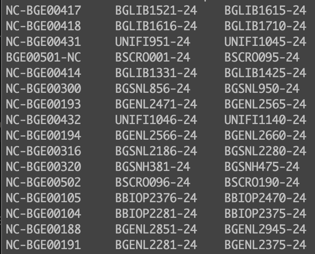
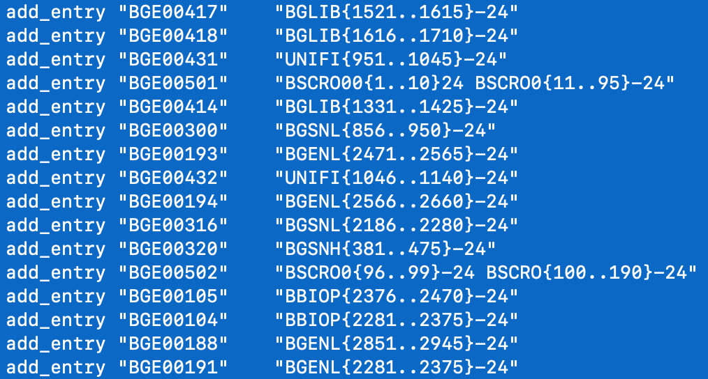
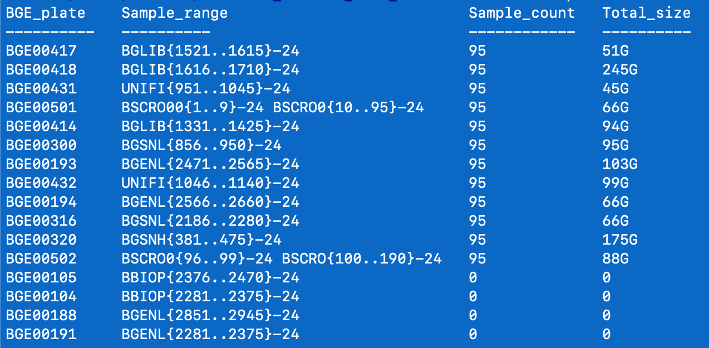
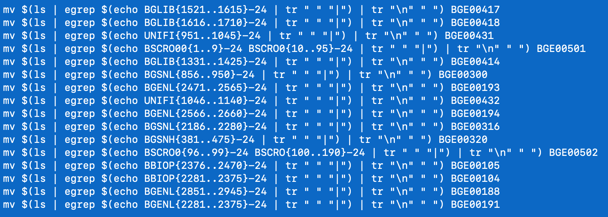

# BGE genome skimming data processing
This document describes the preparation steps for analysing genome skims for [BGE](https://biodiversitygenomics.eu/).
Up to 16 plates (95 samples + 1 negative control per plate) can be sent in a batch (4 index pools) to [SciLifeLab NGI](https://ngisweden.scilifelab.se/).
After sequencing, these data need to be downloaded, checksummed, and split per plate before analyses commence.

## DDS data download
To download data from DDS you need an account and have the [DDS client](https://scilifelabdatacentre.github.io/dds_cli/installation/) installed on your system. You will get an email notification when new data
is available on the DDS server.
Login to the designated MaaS-node and cd to the destination directory. Start a screen session and download the data.
<pre><code>screen -DR getdata_dds -L -Logfile snpseq01159.log
time dds data get --get-all --project snpseq01159</code></pre>

## MD5 Checksums
Run checksums to verify data integrity. Downloaded data can be found in the files folder in the DataDelivery directory, e.g. DataDelivery_2025-03-20_11-26-11_snpseq01159_download/files/YB-4209/20250314_LH00179_0205_A22MGTLLT4 this folder will contain ***checksums.md5*** provided by the sequence centre and is the same location for calculating md5 checksums on our side:
<pre><code>screen -DR checksum
time md5sum $(ls */* | sort -n) > checksums.local.sorted.md5
  # sort the provided checksum file on filename:
cat checksums.md5 | awk '{print $0 | "sort -k2"}' > checksums.sorted.md5
  # make name equal (i.e. name of the parent directory needs to be added):
sed -i 's/Sample_YB/20250314_LH00179_0205_A22MGTLLT4\/Sample_YB/g' checksums.local.sorted.md5
  # check if checksums are identical:
diff checksums.sorted.md5 checksums.local.sorted.md5</code></pre>
If the checksums are identical only four files (.html .zip .md and .csv) will show.

## Sample range
Download the [SampleForm](data/YB-4209_SampleForm.csv) (Ready-made-libraries), for submitting the plates to the sequence centre, as *.csv from [Google Drive](https://drive.google.com/drive/folders/1lxCPhEpvqq0meHPkXx-FaAgUgPk03dtY?usp=drive_link). Use [BGE_range_extract.sh](scripts/BGE_range_extract.sh) to split the data per plate (which facilitates traceability and uploading/retrieving data from S3 storage).
<pre><code>./scripts/BGE_range_extract.sh data/YB-4209_SampleForm.csv</code></pre>
The image below left shows the output for this example. Discrepancies in naming convention are not uncommon (e.g. plate 501) and the conversion of process IDs to brace expansion expressions may require some attention (e.g. plate 501, 502). Therefore it may be best to create these expressions for [run2split.sh](scripts/run2split.sh) manually (image below right). Both filenames and the foldername of the negative control for 501 were corrected to prevent issues in the next steps. As a side note: plates never seem to be given in sorted order (keeping the provided order can aid troubleshooting, e.g. plate-swap detection). 
|   |   |
|--------------------------------|--------------------------------|

## Run2split.sh
Modify [run2split.sh](scripts/run2split.sh) by replacing the "add entry" section with the obtained brace expansion expressions (image above right) and run it on the same directory where the checksums(## MD5 Checksums) were calculated.
<pre><code>./run2split.sh</code></pre>
Six output blocks will be written to sdout. The first block (image below left) shows the number of samples and file size per plate. Each plate should have 95 samples and a negative control and the total file size per plate is generally between ~50 and ~100 Gb. In this example one sequence pool (the last four plates) had higher adapter peaks and was therefore excluded from this run.
|   |
|--------------------------------|

The latter five output blocks write commands to stdout (allowing for a final check). Copy the output and execute. These commands will:  
2. Create BGE plate directories.  
3. Select and move sequence data to the correct plate directories (see image below).  
4. Move the negative controls to the correct plate directories.  
5. Copy the checksums to each plate directory.  
6. Move the plate directories to the desired output location.
|   |
|--------------------------------|

## Backup to NDOR S3
To store data on [Naturalis Digital Object Repository (NDOR)](https://console.ndor.naturalis.io/), the Minio S3 client and [rclone](https://docs.google.com/document/d/1Khsvrmg8hW6EfW8MWnXIXLseChUqcx--Ro9hByhGjVc/edit?tab=t.0#heading=h.6bla1bvhmnq3) need to be installed on the MaaS-node where the data is located.
<pre><code>  # check the total size of the data to be copied
du -hcs $(ls | egrep "^BGE00(417|418|431|501|414|300|193|432|194|316|320|502|105|104|188|191)$") | egrep "total"
  # check availability and contents of destination location
mc ls minio3/dickgroenenberg/skimming/input
  # start a screen session
screen -DR backup -L 
  # copy the data
time (
  for dir in BGE00{417,418,431,501,414,300,193,432,194,316,320,502,105,104,188,191}; do
    rclone copy -v -P "$dir" "minio3:/dickgroenenberg/skimming/input/$dir"
  done
)</code></pre>
